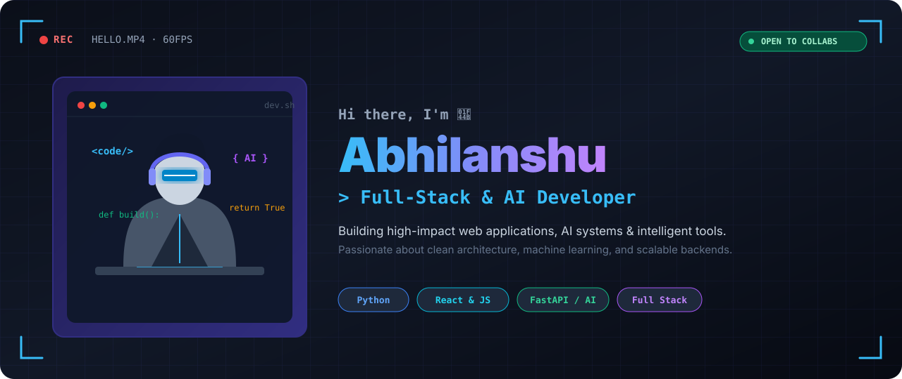
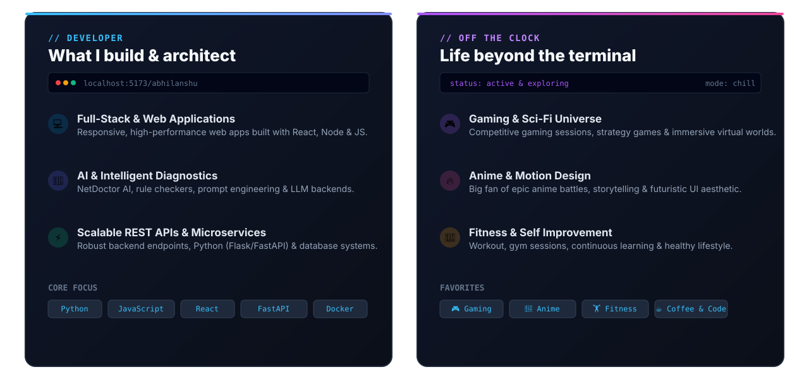
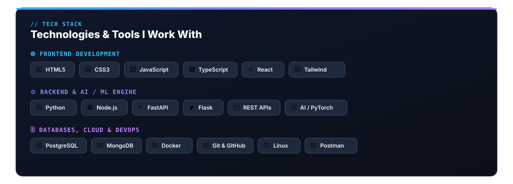

<!-- 🎬 WORLD-CLASS HERO BANNER -->

  

<!-- 👩‍💻 DUAL CARDS: WHAT I BUILD & LIFE BEYOND CODE -->

  

<!-- ⚛️ TECH STACK & ENGINEERING ARSENAL -->

  

<!-- 🪪 DEVELOPER ID & METRICS DASHBOARD -->

  

## 🎌 Featured builds

| Project | What it is | Stack | Link |
|:---|:---|:---|:---:|
| [**AI Personal Finance Mentor**](https://github.com/Abhilanshu) | Intelligent personal finance mentor leveraging AI analytics & budget tracking | `React` `Node.js` `MongoDB` `AI` | 🚀 [View Code](https://github.com/Abhilanshu) |
| [**3D Interactive Web Experience**](https://github.com/Abhilanshu) | Cinematic 3D landing page and interactive web application with WebGL | `Next.js` `TypeScript` `Three.js` `WebGL` | 🚀 [View Code](https://github.com/Abhilanshu) |

 

### 📊 GitHub Analytics

  

  

### 🐍 Contribution Activity

  

  

  
<i>"Code is poetry written for machines, experienced by humans."</i>

  

