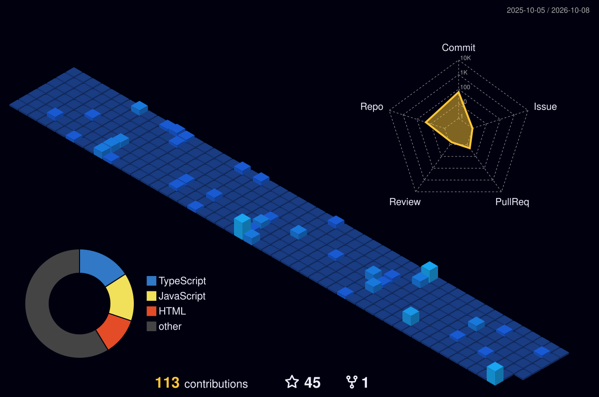

<!-- 🎬 HERO — developer intro + animated banner -->

  

<!-- 👨‍💻 LEFT: what I build   •   🎮 RIGHT: life outside code -->

  

<!-- ⚛️ TECH STACK -->

  

<!-- 🪪 DEVELOPER ID + DASHBOARD -->

  

## ⚡ Featured Projects

| Project | What it is | Tech Stack | Live / Repo |
|:---|:---|:---|:---:|
| [**NetDoctor AI**](https://github.com/Abhilanshu/NET-DOCTOR-) | Intelligent AI-driven network diagnosis & rule verification engine | `Python` `Flask` `AI/LLM` `Cisco` | [🔗 Repo](https://github.com/Abhilanshu/NET-DOCTOR-) |
| [**Full-Stack Web Suite**](https://github.com/Abhilanshu) | High-performance responsive web platform with modern frontend architecture | `React` `JavaScript` `Node.js` `CSS` | [🔗 Repo](https://github.com/Abhilanshu) |
| [**AI Assistant & Automation**](https://github.com/Abhilanshu) | Autonomous task execution, prompt engineering & API integrations | `Python` `FastAPI` `REST` `Docker` | [🔗 Repo](https://github.com/Abhilanshu) |

 

## 🌃 My Contribution City

*Every commit builds another tower — rebuilt automatically every day.*

  

## 🐍 Contribution Snake

  

<!-- 💌 LET'S CONNECT -->

  

 

**Always learning, always building.** ⚡

