<table>
<tr>
<td width="360" align="center" valign="top">

</td>
<td valign="top">

### 🚀 My Builds

<table>
<tr><th>🛰️ Project</th><th>💻 Tech</th><th>⭐</th></tr>
<tr><td><a href="https://github.com/Abhilanshu/GeoSmart-AI">🗺️ GeoSmart AI, crisis resource map</a></td><td><code>MERN</code> <code>Gemini API</code> <code>Google Maps</code></td><td>0</td></tr>
<tr><td><a href="https://github.com/Abhilanshu/NET-DOCTOR-">🧳 TWIP Capstone</a></td><td><code>Python, Flask, AI Engine</code></td><td>0</td></tr>
<tr><td><a href="https://github.com/Abhilanshu/SmartBridge-GenAI">🤖 Generative AI work, SmartBridge</a></td><td><code>GenAI</code> <code>Google Cloud</code></td><td>0</td></tr>
<tr><td><a href="https://github.com/Abhilanshu/MERN-BPH-Tech">⚙️ MERN work, BPH Technologies</a></td><td><code>MongoDB</code> <code>Express</code> <code>React</code> <code>Node.js</code></td><td>0</td></tr>
</table>

> 💙 *"I don't just use AI, I code with it."*

</td>
</tr>
</table>

### 🧰 Tech Stack

### 📊 GitHub Stats & Graphs

### 🐍 Watch the snake eat my contributions

### 📫 Let's Connect

*⭐ Always learning, always building.* 💙

